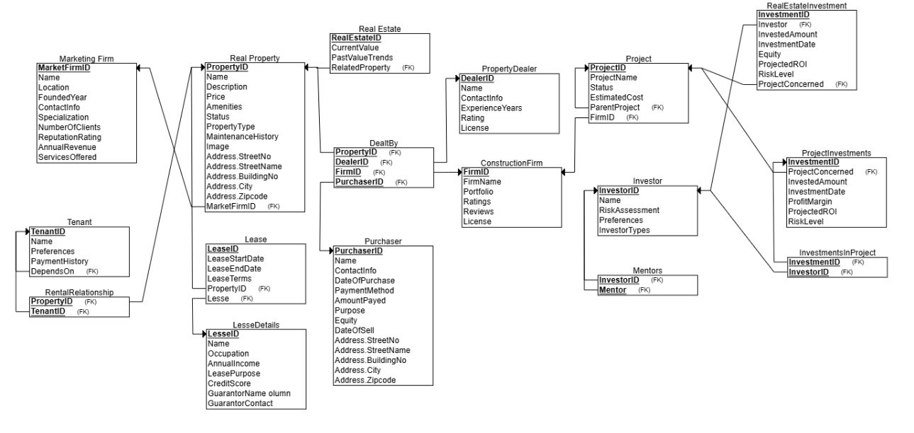

# Advanced Real Estate Management System

## Mini-World Description and Purpose of the Database

This database represents a real estate investment and management platform designed to support a 
diverse range of stakeholders, including investors, tenants, real estate firms, construction companies, 
and marketing agencies. The platform aims to streamline processes related to property investment, 
leasing, tenant management, and project development by organizing and storing critical information. It 
also serves as a comprehensive repository for tracking property transactions, managing leases, and 
maintaining records of real estate investments and construction projects. 
Key entities like investors, tenants, and lessees are linked with properties and projects, allowing detailed 
analysis of investment returns, risk levels, and lease terms. Furthermore, real estate properties, 
construction projects, and marketing firms are tracked to facilitate decision-making based on property 
status, investment performance, and market trends. The database includes entities like PropertyDealer, 
ConstructionFirm, and MarketingFirm, each with attributes and relationships that support industry
specific needs, such as licensing, client histories, and project portfolios. 

### Users and Their Interactions with the Database
The primary users of the database are:
1. **Investors:** They will use the platform to view potential investment opportunities, assess risks, track 
profit margins, monitor projected returns (ROI), and manage their investment portfolios.
2. **Tenants and Lessees:** Tenants can access their lease details, payment histories, and lease terms. 
Lessees provide information about their lease purposes (residential or commercial) and financial 
credentials, which assist investors and property managers in making leasing decisions.
3. **Property Dealers and Construction Firms:** Dealers and construction firms can access 
information on properties, including past sales, current market value, and associated projects. 
Construction firms manage project portfolios, track project histories, and evaluate feedback and 
ratings from investors and lessees.
4. **Marketing Firms:** Marketing agencies use the database to track clients, assess reputation ratings, 
and analyze revenues, enabling them to tailor marketing strategies for available and upcoming 
properties.
5. **Property Managers and Platform Administrators:** They will use the database for an overview of 
all leases, investments, and property statuses to maintain smooth operations, ensure compliance, 
and generate performance reports for stakeholders.

Overall, the database serves as a centralized, structured platform supporting property investment 
decisions, leasing processes, and real estate project development, allowing users to make informed, 
data-driven decisions. With a robust relational design, the database ensures that data is easily accessible 
and maintains consistency across interconnected entities such as investors, tenants, projects, and 
properties. By consolidating data on project histories, investment returns, tenant preferences, and market 
trends, the platform enables users to analyze performance metrics and market dynamics with precision. 
Furthermore, the database supports scalability and adaptability as new properties, projects, and user 
types can be added without disrupting existing records. This flexibility allows real estate firms, investors, 
and purchasers to respond quickly to changing market conditions, assess investment risks, and 
implement targeted marketing and leasing strategies. Ultimately, the platform not only optimizes property 
management and investment operations but also fosters stronger collaboration among industry 
professionals, enhancing transparency, efficiency, and profitability across the real estate ecosystem.

---

## Database Diagrams

### ER Diagram

### Relational Model

### 1NF (First Normal Form)

- All relations are in 1NF (atomic values, no repeating groups).
- See relational model above.

### 2NF (Second Normal Form)

- All relations are in 2NF (since all non-prime attributes are fully functionally dependent on the primary key).
- 2NF is the same as 1NF for this schema.

### 3NF (Third Normal Form)

- All relations are in 3NF (no transitive dependencies; all attributes depend only on the key).
- See relational model for details.